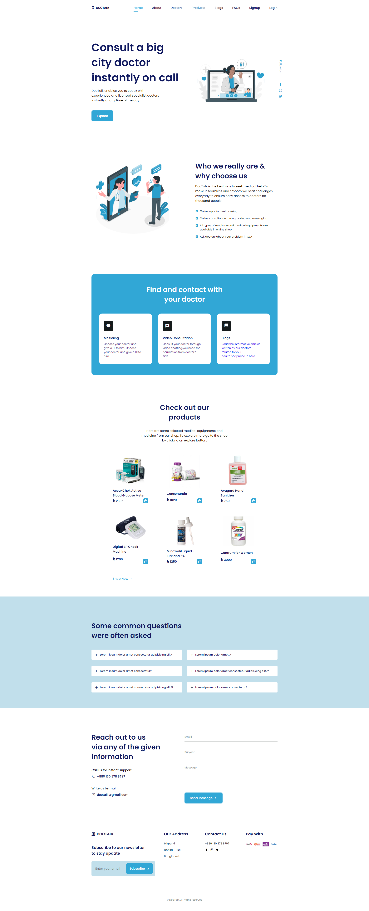

---

<!-- --- is used for underline-->

# Project - DocTalk

## The Frontend Part
---

## Project Description

DocTalk is a complete web application that will allow patients and doctors to communicate online, get e-prescriptions, read and write blogs, buy medicines and ask and answer their general queries. People will choose to stay at home and conduct their meetings online due to the COVID scenario. It will be the ideal platform for doctors and patients to complete online consultations. Our app will make consultations secure and straightforward, reducing time while protecting from Covid. It will facilitate communication between patients and doctors. There will be an interactive portal where doctors will respond to various patient inquiries, saving them time and providing them with reliable information. People will be able to find authentic pharmaceuticals on the e-commerce website.

<!-- This is used for paragraphs--> 
 

---

 

---

| Md. Khaled Zohani Tonmoy | tonmoyzohani@gmail.com  |
 